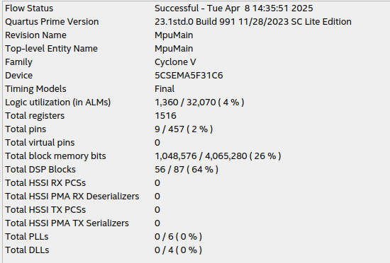

# 📌 Coprocessador Aritmético para Multiplicação Matricial

Este projeto tem como objetivo o desenvolvimento de um **coprocessador aritmético especializado em multiplicação matricial**. Ele foi implementado em linguagem Verilog em uma placa FPGA DE1-SoC.

A proposta é explorar paralelismo e arquitetura para tornar as operações matriciais mais eficientes em sistemas embarcados.

**Requisitos atendidos**:
- Código em Verilog;
- Utiliza apenas componentes da placa DE1-SoC;
- Operações com matrizes quadradas até 5x5 (exceto determinante);
- Operações implementadas:
  - Adição
  - Subtração
  - Multiplicação
  - Multiplicação por número inteiro
  - Determinante
  - Transposta
  - Matriz oposta
- Cada elemento da matriz tem 8 bits (sinalizados);
- Entrada e saída por barramento simples de controle.

## 👥Equipe  
* Cláudio Daniel Figueredo Peruna  
* Paulo Gabriel da Rocha Costa Silva   
* Paulo Henrique Barreto Dantas  

## 📌 Sumário

- [Arquitetura do Sistema](#arquitetura-do-sistema)
- [Descrição das Operações](#operações-implementadas)
- [Equipamentos e Softwares Utilizados](#equipamentos-e-softwares-utilizados)
- [LEs, LABs e Pinos](#les-labs-e-pinos)
- [Execução do Projeto](#execução-do-projeto)
- [Conclusão](#conclusão)

---

## 🧠 Arquitetura do Sistema

O módulo principal, `main`, atua como o processador central e **controlador da máquina de estados**. Ele instancia o módulo `MpuOperations`, que é responsável pela execução das operações aritméticas. O `main` também gerencia a leitura e escrita de dados da memória da FPGA, além de coordenar o fluxo dos estados lógicos.

Dentro do módulo `MpuOperations`, estão implementadas as sete operações possíveis: adição, subtração, multiplicação por escalar, matriz oposta, transposição, determinante e multiplicação matricial. A seleção da operação é feita via um campo de **opcode de 3 bits**, passado pelas chaves da placa.

As matrizes A e B são representadas como vetores de 200 bits (25 elementos de 8 bits), e recebidas como entradas junto com o parâmetro `size` (para definir o tamanho da matriz quadrada) e `factor` (utilizado na multiplicação por escalar e pode ser um número com sinal). O resultado da operação também é retornado em um vetor de 200 bits, mesmo em operações como determinante que produzem um único valor.

A lógica de **máquina de estados finitos (FSM)** é responsável por sequenciar corretamente as operações de leitura da memória, execução e escrita do resultado. Os estados incluem:
1. Estado inicial e de preparação;
2. Estados de leitura das matrizes A e B;
3. Estado de envio da operação a ser realizada;
4. Estados de escrita do resultado na memória;
5. Estado final de desativação do sinal de escrita, retornando ao estado inicial.

O controle das operações é realizado via **interface física da placa DE1-SoC**, utilizando:
- **3 chaves (SW[2:0])** para seleção do **opcode** da operação;
- **1 chave (SW[3])** para o parâmetro `size` da matriz (usado especialmente para a operação de determinante);
- **1 botão** (KEY[0]) para o **clock**, que controla as transições da FSM.

A **memória** é acessada por meio de um módulo separado, instanciado no `main`. O controle de leitura e escrita é feito com sinais de **`read_enable` e `write_enable`**, definidos em estados específicos da FSM. Durante os estados de leitura, o endereço é ajustado para carregar os dados das matrizes A e B. Já nos estados de escrita, o sinal `write_enable` é ativado para armazenar o resultado da operação no endereço de saída definido.

Além disso, a multiplicação matricial é realizada em cinco ciclos de clock, processando uma linha por ciclo, sem uso de pipeline. Já para o **determinante**, foram implementadas funções auxiliares para matrizes 2x2 e 3x3, com lógica condicional para decidir qual aplicar, de acordo com o valor de `size`.

---

## ➕➖✖️ Descrição das Operações

As operações aritméticas implementadas no módulo `MpuOperations.v` são controladas por um sinal de **opcode de 3 bits**, que define qual operação será executada. O módulo recebe como entrada duas matrizes (A e B), codificadas como vetores de 200 bits (25 elementos de 8 bits cada), além de parâmetros como `factor`, `size` e `clock`. O resultado é retornado também em um vetor de 200 bits.

#### 🎯 Mapeamento de Opcode
- `000` – Adição de Matrizes  
- `001` – Subtração de Matrizes  
- `010` – Multiplicação por Escalar (`factor`)  
- `011` – Matriz Oposta  
- `100` – Transposta  
- `101` – Determinante  
- `110` – Multiplicação Matricial  
- Outros valores são ignorados pelo `case`.

#### 🧮 Bloco `case` e Execução das Operações
Todas as operações são implementadas dentro de um bloco `always` sensível à borda positiva do clock. A escolha da operação é feita por um `case` que depende do `opcode`. Cada operação está encapsulada em uma estrutura que recebe suas respectivas entradas e produz o resultado final.

#### ➕ Adição de Matrizes (`opcode 000`)
- Utiliza o bloco `generate` para percorrer os 25 elementos das matrizes A e B.
- Soma elemento a elemento (a cada 8 bits) e armazena no vetor de saída.
- Utiliza macros auxiliares para facilitar o acesso aos elementos do vetor.

#### ➖ Subtração de Matrizes (`opcode 001`)
- Idêntica à adição no uso de `generate`, mas executa a operação de subtração.
- Opera elemento a elemento com 8 bits.

#### ✖️ Multiplicação por Escalar (`opcode 010`)
- Multiplica cada elemento da matriz A pelo valor de `factor` (8 bits com sinal).
- A operação é feita em um bloco `generate`, com repetição automática.

#### 🔁 Matriz Oposta (`opcode 011`)
- Inverte o sinal de cada elemento da matriz A.
- Implementação também baseada em `generate`, aplicando o sinal negativo a cada posição.

#### 🔄 Transposta (`opcode 100`)
- Inverte as posições dos elementos IJ para JI.
- Implementada com bloco `generate`, alterando os índices de escrita no vetor de saída.
- Utiliza lógica simples de troca de índices com base no tamanho da matriz.

#### 📐 Determinante (`opcode 101`)
- Usa funções `function Det2` e `function Det3` para cálculo do determinante de matrizes 2x2 e 3x3, respectivamente.
- A escolha da função depende do valor do parâmetro `size`.
  - `size == 1` → retorna o único valor da matriz.
  - `size == 2` → utiliza `Det2`.
  - `size == 3` → utiliza `Det3`.
- Utiliza operadores condicionais (`assign`) para multiplexar o resultado correto.
- O resultado é replicado no vetor de 200 bits, mesmo que só ocupe um valor.

#### ✖️ Multiplicação de Matrizes (`opcode 110`)
- Opera linha por linha da matriz A com as colunas da matriz B.
- Utiliza **cinco ciclos de clock**, com controle via contador `row`.
- Em cada ciclo, calcula o resultado de uma linha completa da matriz resultante.
- A lógica segue o algoritmo matemático tradicional de multiplicação de matrizes.
- Após concluir as 5 linhas, o contador `row` é reiniciado.

#### Entradas Utilizadas por Operação
| Operação                   | Matriz A | Matriz B | Factor | Size | Clock |
|---------------------------|----------|----------|--------|------|-------|
| Adição                    | ✅       | ✅       | ❌     | ❌   | ❌    |
| Subtração                 | ✅       | ✅       | ❌     | ❌   | ❌    |
| Multiplicação por Escalar | ✅       | ❌       | ✅     | ❌   | ❌    |
| Oposta                    | ✅       | ❌       | ❌     | ❌   | ❌    |
| Transposta                | ✅       | ❌       | ❌     | ❌   | ❌    |
| Determinante              | ✅       | ❌       | ❌     | ✅   | ❌    |
| Multiplicação Matricial   | ✅       | ✅       | ❌     | ❌   | ✅    |

---

## 🖥️ Equipamentos e Softwares Utilizados

Para o desenvolvimento e execução do projeto do coprocessador aritmético especializado em multiplicação matricial, utilizamos os seguintes recursos de hardware e software:

- **Placa FPGA**: Utilizamos a plataforma **DE1-SoC**, equipada com um FPGA da família Cyclone V e um **processador ARM (HPS)** integrado. Essa placa permitiu a prototipação eficiente das operações aritméticas com matrizes.

- **Software de Desenvolvimento**:
  - **Quartus Prime**: Ambiente principal para **desenvolvimento, síntese e programação** dos módulos em Verilog.

- **Linguagens Utilizadas**:
  - **Verilog HDL**: Para desenvolvimento do coprocessador, incluindo o módulo `MpuOperations.v`, FSM e controle de memória.
  - **C**: Para interações com o HPS.

- **Ambiente de Desenvolvimento**:
  - Os testes e compilações foram realizados em um sistema com **Sistema Operacional Linux (Ubuntu)**, compatível com as versões educacionais do Quartus.

- **Programação da FPGA**:
  - A transferência do projeto compilado para a placa DE1-SoC foi feita via **interface JTAG**, utilizando o **Programmer** integrado ao Quartus Prime.
---

## 🔌 LEs, LABs e Pinos

O projeto utilizou recursos da placa **DE1-SoC** de forma eficiente, com baixo consumo de lógica e pinos. Os principais pontos são:

- **Utilização de Lógica**:  
  Foram utilizados **1.360 ALMs (Adaptive Logic Modules)** de um total de 32.070 disponíveis na FPGA **Cyclone V**, representando **apenas 4%** da capacidade total.

- **Uso de Registradores**:  
  O design inclui **1.516 registradores**, distribuídos para controle da FSM, armazenamentos parciais de operação e contadores internos (como o `row` na multiplicação matricial).

- **Pinos Utilizados**:  
  Foram utilizados **9 pinos físicos** da FPGA (2% dos 457 disponíveis), conectando:
  - **3 chaves (SW[2:0])** para controle do **opcode** das operações;
  - **1 chave (SW[3])** para o parâmetro `size`;
  - **1 botão (KEY[0])** para o **clock** do sistema;
  - Demais pinos utilizados para entrada e saída de dados via barramento simples e controle de leitura/escrita.

- **Blocos de Memória**:  
  O projeto utilizou **1.048.576 bits de memória** dos **4.065.280 bits** disponíveis, o que representa **26% da memória total**, alocada principalmente para as matrizes A, B e o resultado.

- **Blocos DSP**:  
  Foram utilizados **56 blocos DSP**, o equivalente a **64%** dos disponíveis, indicando que operações como multiplicações e somas foram otimizadas com recursos dedicados de hardware.

- **Conexões e Mapeamento**:  
  O mapeamento dos pinos foi realizado no **Pin Planner do Quartus**, assegurando compatibilidade com os periféricos da placa. Os pinos foram atribuídos conforme os padrões da DE1-SoC, respeitando os bancos de I/O para chaves, botões e LEDs.

> A seguir, uma captura do relatório de síntese mostra o detalhamento do uso de recursos da FPGA:

---

## ▶️ Execução do Projeto

Para compilar e executar o projeto na plataforma DE1-SoC utilizando o Quartus Prime Lite, siga os seguintes passos:

### 📦 1. Compilação do Projeto
1. Abra o Quartus Prime Lite Edition.
2. No menu superior, vá até `File > Open Project` e selecione o projeto principal (`MpuMain.qpf`).
3. Clique no botão de **Start Compilation** ou acesse pelo menu: `Processing > Start Compilation`.
4. Aguarde até o final da compilação. O processo pode levar alguns minutos.

### 💾 2. Gravação na FPGA
1. Conecte a placa DE1-SoC ao computador via cabo USB-Blaster.
2. Vá em `Tools > Programmer`.
3. No campo “Hardware Setup…”, selecione `USB-Blaster [USB-0]`.
4. Verifique se o `.sof` gerado está corretamente carregado.
5. Clique em “Start” para gravar o projeto na FPGA.

### 🧠 3. Inserção de Dados na Memória Interna
1. Após a programação da FPGA, vá em `Tools > In-System Memory Content Editor`.
2. Com o JTAG configurado, selecione a memória instanciada no projeto.
3. Insira os valores correspondentes à matriz A e matriz B manualmente na memória (conforme o endereço esperado pela FSM).
4. A memória possui 256 bits de largura e 4096 de profundidade, com modo de acesso `Read/Write`.

### 🎮 4. Execução na Placa
A interação com o sistema é feita diretamente pelos elementos físicos da placa:

- **Chaves (SW):**
  - SW[2:0] → Código da operação (opcode):
    - `000`: Adição
    - `001`: Subtração
    - `010`: Multiplicação por escalar
    - `011`: Matriz oposta
    - `100`: Transposta
    - `101`: Determinante
    - `110`: Multiplicação matricial
  - SW[3] → Define o tamanho da matriz (`size`)
  
- **Botão (KEY[0]):**
  - Usado como **clock manual** para avançar os estados da máquina de controle.
  - Cada pressionamento do botão representa uma borda de subida do clock.

### 📤 5. Visualização do Resultado
Após a execução da operação, o resultado será gravado de volta na memória. Para visualizar:
1. Acesse novamente o **In-System Memory Content Editor**.
2. Leia os valores atualizados nos endereços de saída definidos pela FSM.
3. Interprete os valores como matriz 5x5 (caso completo), considerando 8 bits por elemento.

---

## ✅ Conclusão

O desenvolvimento deste coprocessador aritmético especializado em multiplicação matricial proporcionou uma experiência prática valiosa na aplicação de conceitos de circuitos digitais e arquitetura de computadores. Através da linguagem Verilog, foi possível estruturar uma solução modular e eficiente, utilizando máquinas de estados finitos (FSM) para controle sequencial e barramentos simples para comunicação com a memória da FPGA.

Durante a construção do projeto, foi possível aprender e aplicar com profundidade:
- A manipulação de dados em formato de vetor binário (200 bits representando 25 elementos de 8 bits);
- O uso de blocos `generate` para simplificar operações matriciais em larga escala;
- O controle da memória da FPGA utilizando sinais de `read_enable`, `write_enable` e endereçamento sequencial;
- A implementação de operações paralelas e arquitetura, otimizando a multiplicação de matrizes em múltiplos ciclos de clock;
- A criação de funções internas no Verilog (`function Det2` e `Det3`) para operações matemáticas reutilizáveis.

Entre as dificuldades enfrentadas, destacam-se o mapeamento correto dos dados na memória e a sincronização entre leitura, processamento e escrita — especialmente durante o controle da FSM. Essas dificuldades foram superadas com testes incrementais, análise das transições de estados.

Todos os requisitos definidos no enunciado do projeto foram atendidos, com exceção do cálculo da determinante para matrizes de tamanho 4x4 e 5x5. As operações implementadas foram:

- ✅ Adição de matrizes  
- ✅ Subtração de matrizes  
- ✅ Multiplicação de matriz por escalar  
- ✅ Matriz oposta  
- ✅ Transposta  
- ✅ Multiplicação de matrizes  
- ⚠️ Determinante (*limitado a matrizes até 3x3*)

Outros requisitos também foram contemplados:
- ✅ Código em Verilog utilizando apenas os recursos da DE1-SoC  
- ✅ Representação dos elementos com 8 bits  
- ✅ Paralelismo na multiplicação  
- ✅ Comunicação via barramento simples  
- ❌ Comunicação com o processador ARM (HPS) não foi implementada

Como ponto de melhoria, destaca-se a possibilidade futura de implementar o cálculo da determinante para matrizes de ordem 4 e 5, utilizando expansão por cofatores ou outras técnicas mais avançadas. Além disso, seria interessante explorar a comunicação direta com o HPS via Avalon para envio e leitura dos dados em tempo real.

Outro aspecto que pode ser aprimorado é a construção da máquina de estados. Embora funcional, parte de sua estrutura foi desenvolvida com soluções pontuais e pouco padronizadas, o que pode dificultar manutenção e escalabilidade. Uma reformulação visando maior clareza e modularização dos estados traria benefícios tanto para a legibilidade quanto para a robustez do projeto.

---

